<header>
  

    <nav class="navbar navbar-expand-lg fixed-top navbar-transparent bg-primary" color-on-scroll="400">
      

        

          

            <a class="btn btn-link" target="_blank" href="https://www.linkedin.com/in/yoann-saunier-536368151">
              <i class="fab fa-linkedin"></i>
            </a>
            <a class="btn btn-link" target="_blank" href="https://github.com/ynnsnr">
              <i class="fab fa-github"></i>
            </a>
            <a class="btn btn-link" target="_blank" href="https://twitter.com/yoann_saunier">
              <i class="fab fa-twitter"></i>
            </a>
          

          <button type="button" class="navbar-toggler" data-toggle="dropdown">
            
            
            
          </button>
          

            

              <a href="#experience" class="smooth-scroll">Experience</a>
            

            

              <a href="#skills" class="smooth-scroll">Skills</a>
            

            

              <a href="#education" class="smooth-scroll">Education</a>
            

            

              <a href="#contact" class="smooth-scroll">Contact</a>
            

          

        

        

          <ul class="navbar-nav">
            <li class="nav-item">
              <a class="nav-link smooth-scroll waves-effect waves-light" href="#experience">Experience</a>
            </li>
            <li class="nav-item">
              <a class="nav-link smooth-scroll waves-effect waves-light" href="#skill">Skills</a>
            </li>
            <li class="nav-item">
              <a class="nav-link smooth-scroll waves-effect waves-light" href="#education">Education</a>
            </li>
            <li class="nav-item">
              <a class="nav-link smooth-scroll waves-effect waves-light" href="#contact">Contact</a>
            </li>
          </ul>
        

      

    </nav>
  

</header>

  

    

      

        

        

        

          

            

              
            

            
Yoann Saunier

            
Full Stack Web Developer

            

              <a class="btn btn-primary waves-effect waves-light m-1 smooth-scroll" href="#contact" data-aos="zoom-in" data-aos-anchor="data-aos-anchor">Contact</a>
              <a class="btn btn-primary waves-effect waves-light m-1" href="assets/pdf/resume-yoann-saunier.pdf" data-aos="zoom-in" data-aos-anchor="data-aos-anchor" target="_blank">Resume</a>
            

          

        

      

    

  

  

    

      

        

          
About me

          

            I'm a Full Stack Web Developer with an entrepreneurial mindset and a strong Front-End sensitivity. Formely working as a Front-End Developer at <a href="https://www.manatal.com" target="_blank">Manatal</a>, a recruiting software company using Vue.js, Vuetify, Chrome Extensions and Django REST, and as a Teaching Assistant at <a href="https://www.lewagon.com" target="_blank">Le Wagon</a> in Paris, Casablanca, Berlin & Shanghai.
          

          

            I used to work as an audio engineer / music composer and I'm deeply interested in blending technology, creativity and arts. With a curious mindset, I love tech, traveling, humour, arts and surfing.
          

          

            You'd know me better by also checking out my <a href="https://ynnsnr.github.io/music" target="_blank">music</a>.
          

        

      

    

  

  

    

      

        

          

            <i class="fas fa-suitcase"></i> Projects
          

        

      

      

        

          

            

              

                CinePursuit
              

              
Jury prize for the <a href="https://lesarcs-filmfest.com/fr/professionnels/hackathon-du-cinema" target="_blank">Hackathon du Cinema</a> with Le Wagon team, in collaboration with <a href="https://github.com/db0sch" target="_blank">Dimitri Bosch</a>, <a href="https://github.com/juliends" target="_blank">Julien Da Silva</a> and <a href="https://github.com/grmnlrt" target="_blank">Germain Loret</a>.

              

                <a href="https://cinepursuit.com" target="_blank">CinePursuit</a> is a quiz application to help cinema owners and distributors to retain their audience.
              

            

            

              

                

                  <a href="http://cinepursuit.com" target="_blank">
                    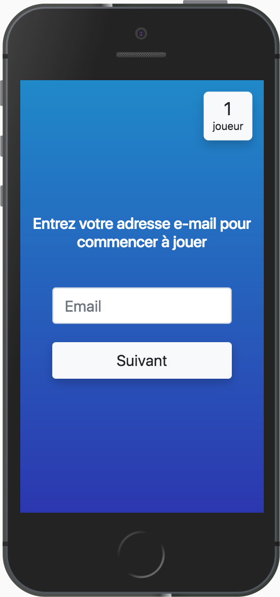
                  </a>
                

                

                  <a href="http://cinepursuit.com" target="_blank">
                    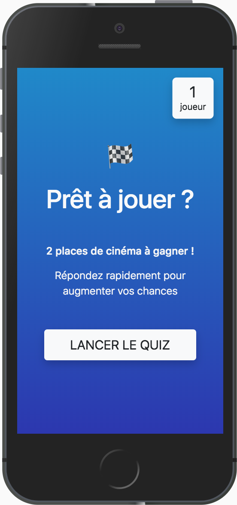
                  </a>
                

                

                  <a href="http://cinepursuit.com" target="_blank">
                    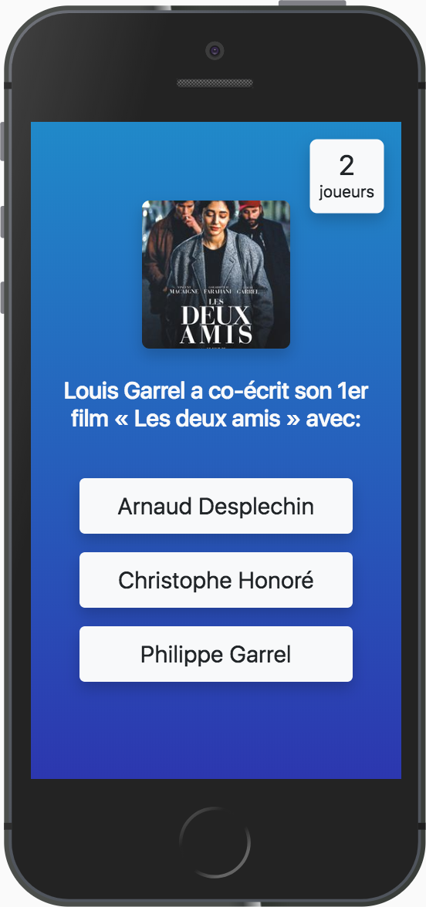
                  </a>
                

                

                  <a href="http://cinepursuit.com" target="_blank">
                    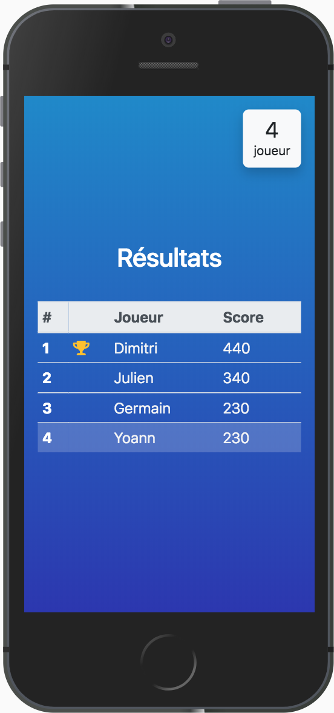
                  </a>
                

              

            

          

          

          

            

              

                Gmail Email Templates
                
              

              
<a href="https://github.com/ynnsnr/gmail-email-templates" target="_blank">Gmail Email Templates</a> is a chrome extension using inboxSDK and React for managing personal email templates (snippets) directly into Gmail with just a couple of clicks.

            

            

              <ul id="gifs">
                <li>
                  <a href="https://github.com/ynnsnr/gmail-email-templates" target="_blank">
                    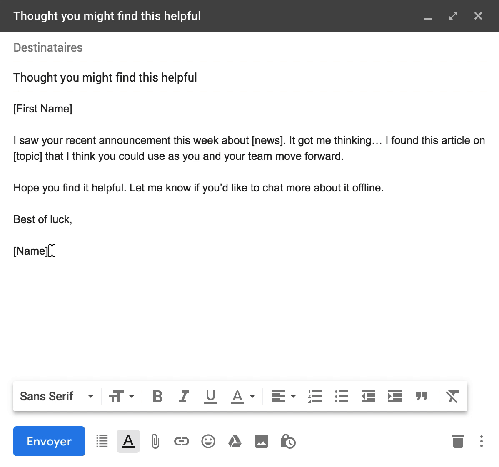
                  </a>
                </li>
                <li>
                  <a href="https://github.com/ynnsnr/gmail-email-templates" target="_blank">
                    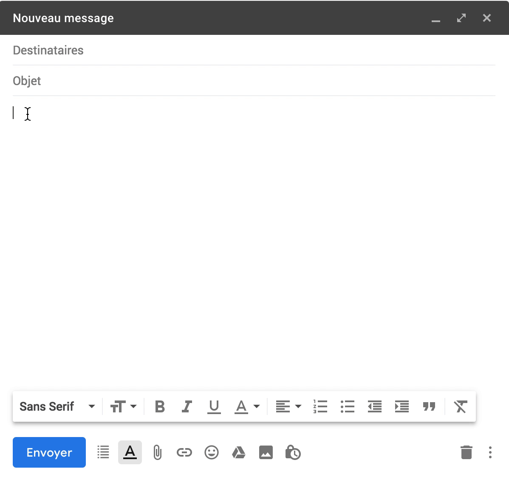
                  </a>
                </li>
              </ul>
            

          

          

          

            

              
Treep

              

                <a href="http://treep.pw" target="_blank">Treep</a> is the final project I made with my team during <a href="https://www.lewagon.com" target="_blank">Le Wagon</a>. A visual decision system tool for travel agencies. By helping them create trips quickly and easily, and visualizing different possible itineraries, <a href="http://treep.pw" target="_blank">Treep</a> enhances both flexibility and communication with travelers.
              

            

            

              <!-- <ul id="imageGallery">
                <li><a href="assets/images/treep-home.jpg">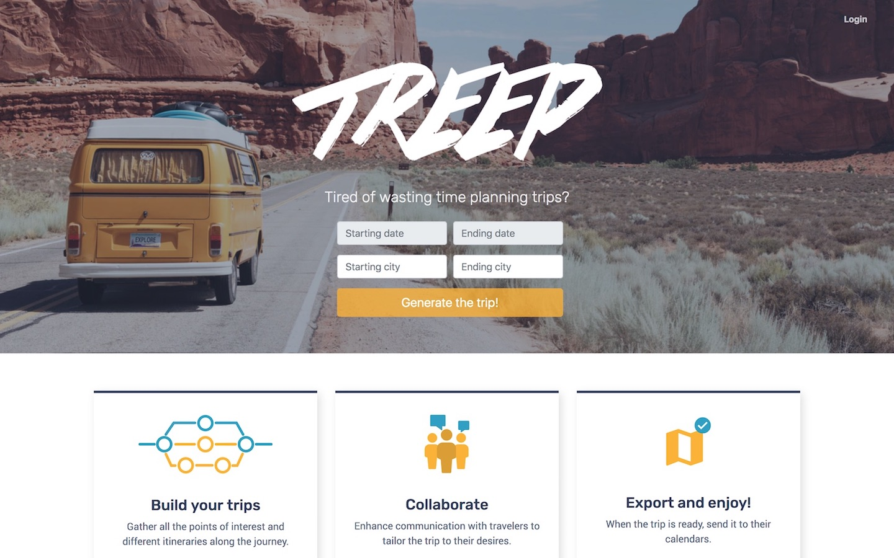</a></li>
                <li><a href="assets/images/treep-index.jpg">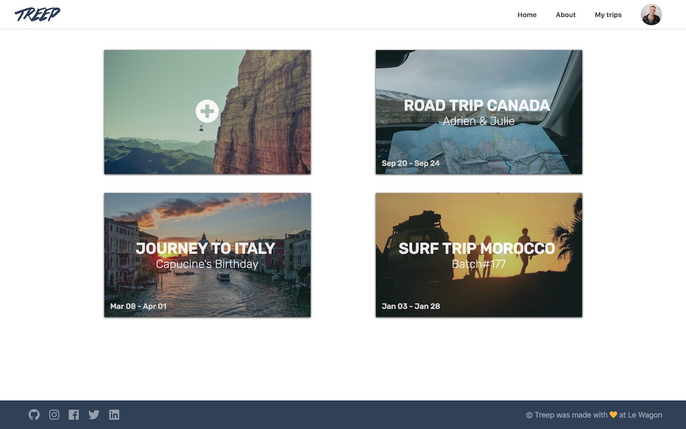</a></li>
                <li><a href="assets/images/treep-show.jpg">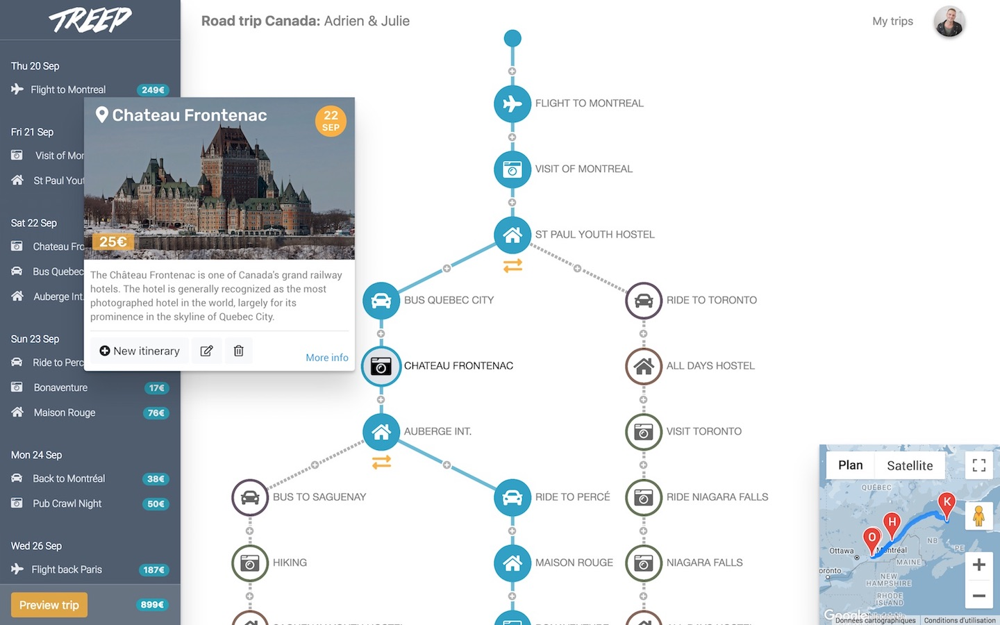</a></li>
                <li><a href="assets/images/treep-preview.jpg">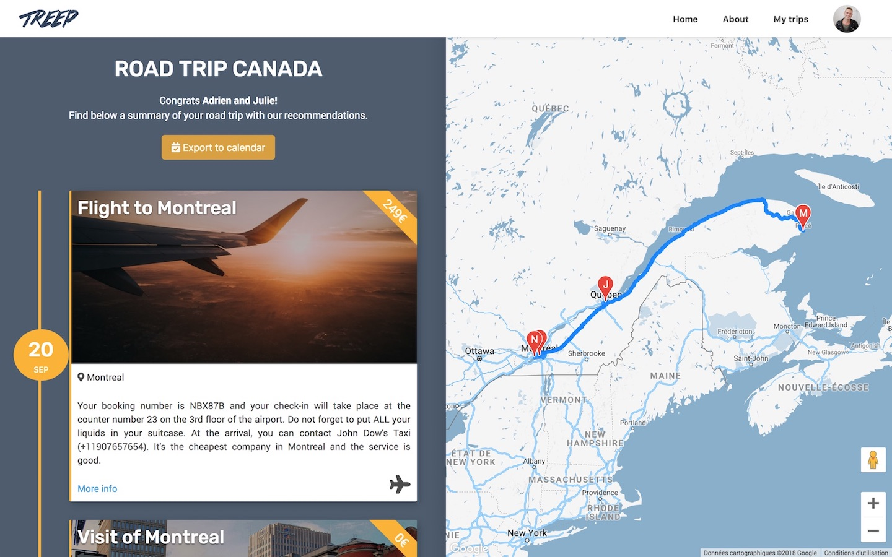</a></li>
              </ul> -->
              

                

              

            

          

          

          

            

              
Awesome Suits

              
<a href="http://awesome-suits.herokuapp.com" target="_blank">Awesome Suits</a> was created for a coding challenge at <a href="https://www.lewagon.com" target="_blank">Le Wagon</a>. A clone of AirBnB that operates a suits renting service between individuals.

            

            

              <ul id="imageGallery">
                <li>
                  <a href="assets/images/awesome-suits-home.jpg">
                    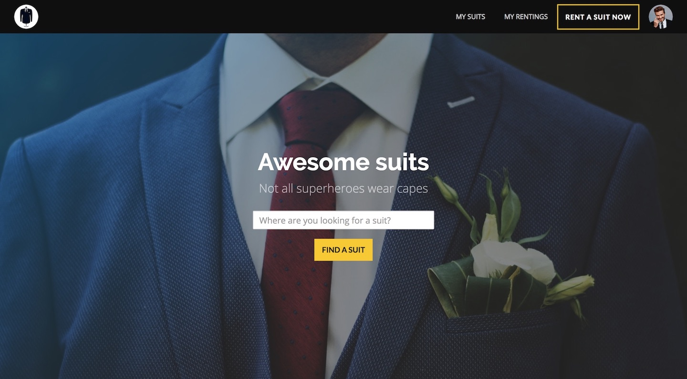
                  </a>
                </li>
                <li>
                  
                </li>
                <li>
                  <a href="assets/images/awesome-suits-owner.jpg">
                    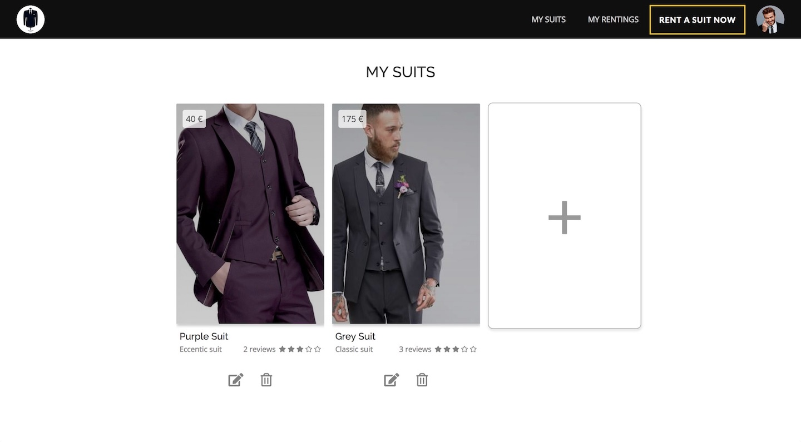
                  </a>
                </li>
                <li>
                  <a href="assets/images/awesome-suits-rentings.jpg">
                    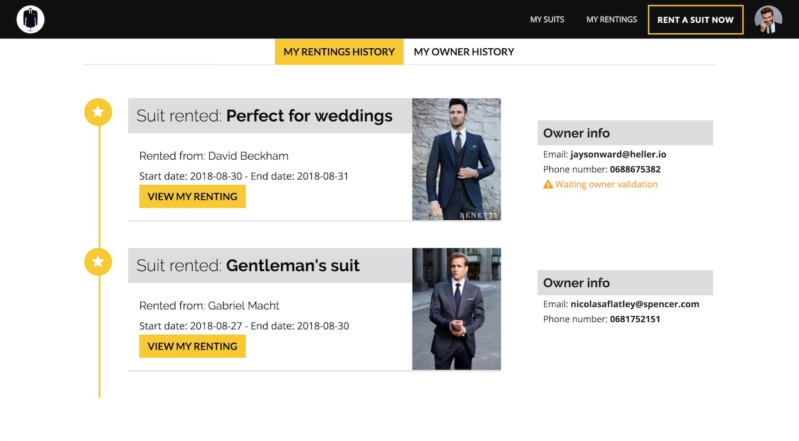
                  </a>
                </li>
              </ul>
            

          

        

      

    

  

  

    

      

        <i class="fas fa-palette"></i> Skills
      

      

        

          

            

              <h6 class="mt-1 mb-3">Front-End</h6>
              

                

                  
HTML5

                  
CSS / SASS

                  
JS / ES6

                

                

                  
Bootstrap

                  
React

                  
Vue.js

                

              

            

            

              <h6 class="mt-1 mb-3">Back-End</h6>
              

                

                  

                    Ruby
                  

                  

                    Rails
                  

                  

                    Webpack
                  

                

                

                  

                    Middleman
                  

                  

                    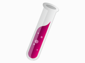Jekyll
                  

                  

                    Sinatra
                  

                

              

            

            

              <h6 class="mt-1 mb-3">DevOps / Misc</h6>
              

                

                  

                    Heroku
                  

                  

                    Github
                  

                  

                    Extensions
                  

                

                

                  

                    PostGreSQL
                  

                  

                    Git
                  

                  

                    WeChat MP
                  

                

              

            

          

          <!-- 

            
          
 -->
        

      

    

  

  

    

      

        <i class="fas fa-graduation-cap"></i> Education
      

      

        

          

            

              
Summer 2018

              
FullStack Developer

            

          

          

            

              
Web Development

              
Le Wagon Paris (Batch # 177)

              
9-week intensive coding bootcamp learning HTML, CSS, Bootstrap, Javascript, jQuery, SQL, git, GitHub, Heroku, and Ruby on Rails. Designed, Implemented and Shipped to production a <a href="http://awesome-suits.herokuapp.com" target="_blank">clone of AirBnB</a> and a Rails prototype of <a href="http://treep.pw" target="_blank">Treep</a>

            

          

        

      

      

        

          

            

              
2010 - 2014

              
Master’s degree

            

          

          

            

              
Formation Supérieure aux Métiers du Son

              
Conservatory of Paris

              
The challenge of this <a href="http://www.conservatoiredeparis.fr/disciplines/les-disciplines/les-disciplines-detail/discipline/formation-superieure-aux-metiers-du-son" target="_blank">original curriculum</a> is to transmit to future professionals, high-level skills both musical and technical.

            

          

        

      

      

        

          

            

              
2008 - 2010

              
Bachelor’s Degree

            

          

          

            

              

                Higher School Preparatory Classes: Ciné-Sup
              

              
Guist’hau high school, Nantes

              

                <a href="https://guisthau.paysdelaloire.e-lyco.fr/le-superieur/cine-sup" target="_blank">Two-year intensive program</a> for national competitive exams of schools of Cinema and Audiovisual: Fémis, Louis Lumière, INSAS, CNSMDP, ENSATT...
              

            

          

        

      

    

  

  

    

      

        

          

            
Contact

            

              <a href="mailto:yoann@saunier.me">yoann@saunier.me</a>
              

                <a class="cc-social btn btn-link" target="_blank" href="https://www.linkedin.com/in/yoann-saunier-536368151" >
                  <i class="fab fa-linkedin fa-3x"></i>
                </a>
                <a class="cc-social btn btn-link" target="_blank" href="https://github.com/ynnsnr">
                  <i class="fab fa-github fa-3x"></i>
                </a>
                <a class="cc-social btn btn-link" target="_blank" href="https://twitter.com/yoann_saunier">
                  <i class="fab fa-twitter fa-3x"></i>
                </a>
              

            

          

        

      

    

  

