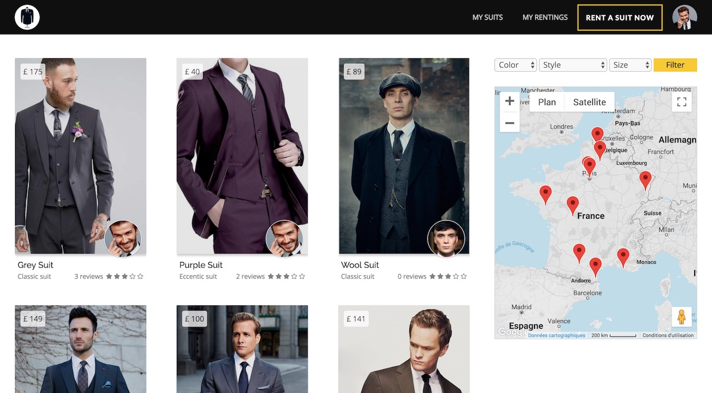

---
# Feel free to add content and custom Front Matter to this file.
# To modify the layout, see https://jekyllrb.com/docs/themes/#overriding-theme-defaults

layout: default
title: Yoann Saunier | Full Stack Web Developer
---
<header>
  

    <nav class="navbar navbar-expand-lg fixed-top navbar-transparent bg-primary" color-on-scroll="400">
      

        

          

            <a class="btn btn-link" href="https://www.linkedin.com/in/yoann-saunier-536368151">
              <i class="fab fa-linkedin"></i>
            </a>
            <a class="btn btn-link" href="https://github.com/ynnsnr">
              <i class="fab fa-github"></i>
            </a>
            <!-- <a class="btn btn-link" href="https://www.facebook.com/djyoyo">
              <i class="fab fa-facebook"></i>
            </a> -->
            <a class="btn btn-link" href="https://twitter.com/yoann_saunier">
              <i class="fab fa-twitter"></i>
            </a>
          

          <button type="button" class="navbar-toggler" data-toggle="dropdown">
            
            
            
          </button>
          

            

              <a href="#experience" class="smooth-scroll">Experience</a>
            

            

              <a href="#skills" class="smooth-scroll">Skills</a>
            

            

              <a href="#education" class="smooth-scroll">Education</a>
            

            

              <a href="#contact" class="smooth-scroll">Contact</a>
            

          

        

        

          <ul class="navbar-nav">
            <li class="nav-item">
              <a class="nav-link smooth-scroll" href="#experience">Experience</a>
            </li>
            <li class="nav-item">
              <a class="nav-link smooth-scroll" href="#skill">Skills</a>
            </li>
            <li class="nav-item">
              <a class="nav-link smooth-scroll" href="#education">Education</a>
            </li>
            <li class="nav-item">
              <a class="nav-link smooth-scroll" href="#contact">Contact</a>
            </li>
          </ul>
        

      

    </nav>
  

</header>

  

    

      

        

        

          

            

            
Yoann Saunier

            
Full Stack Web Developer

            <a class="btn btn-primary smooth-scroll mr-2" href="#contact" data-aos="zoom-in" data-aos-anchor="data-aos-anchor">Contact</a>
            <!-- <a class="btn btn-primary" href="#" data-aos="zoom-in" data-aos-anchor="data-aos-anchor">Download CV</a> -->
          

        

      

    

  

  

    

      

        

          
About

          
I'm a Junior Full Stack Web Developer with a strong Front-End sensitivity and an entrepreneurial mindset. I used to work as a music composer / sound engineer and I'm deeply interested in blending creativity and technology. I've just finished attending <a href="https://www.lewagon.com" target="_blank">Le Wagon</a>, a 9-week intensive coding bootcamp and I'm ready to translate my skills to the web development world.

          
You'd know me better by checking out my <a href="https://ynnsnr.github.io/music" target="_blank">music</a>.

        

      

    

  

  

    

      

        

          
<i class="fas fa-suitcase"></i> Experience

        

      

      

        

          

            

              
Treep

              
<a href="http://treep.pw" target="_blank">Treep</a> is the final project I made with my team during <a href="https://www.lewagon.com" target="_blank">Le Wagon</a>. A visual decision system tool for travel agencies. By helping them create trips quickly and easily, and visualizing different possible itineraries, <a href="http://treep.pw" target="_blank">Treep</a> enhances both flexibility and communication with travelers.

            

            

              <!-- <ul id="imageGallery">
                <li></li>
                <li></li>
                <li></li>
                <li></li>
              </ul> -->
              

                

              

            

          

          

          

            

              
Awesome Suits

              
<a href="http://awesome-suits.herokuapp.com" target="_blank">Awesome Suits</a> was created for a coding challenge at <a href="https://www.lewagon.com" target="_blank">Le Wagon</a>. A clone of AirBnB that operates a suits renting service between individuals.

            

            

              <ul id="imageGallery">
                <li></li>
                <li></li>
                <li></li>
                <li></li>
              </ul>
            

          

          

          

            

              
Gmail Email Templates

              
<a href="https://github.com/ynnsnr/gmail-email-templates" target="_blank">Gmail Email Templates</a> is a chrome extension for managing personal email templates (snippets) directly into Gmail with just a couple of clicks.

            

            

              <ul id="gifs">
                <li>
                  
                </li>
                <li>
                  
                </li>
              </ul>
            

          

        

      

    

  

  

    

      
<i class="fas fa-palette"></i> Skills

      

        

          

            

              <h6>Back-End</h6>
              
Ruby

              
Ruby on Rails

              
Middleman

              
Jekyll

            

            

              <h6>Front-End</h6>
              
HTML5

              
CSS3 / SASS

              
Javascript / ES6

              
Bootstrap

              
React

            

            

              <h6>Database</h6>
              
PostGreSQL

            

            

              <h6>DevOps</h6>
              
Git

              
Github

              
Heroku

            

          

          <!-- 

            
          
 -->
        

      

    

  

  

    

      
<i class="fas fa-graduation-cap"></i> Education

      

        

          

            

              
Summer 2018

              
FullStack Developer

            

          

          

            

              
Web Development

              
Le Wagon Paris (Batch # 177)

              
9-week intensive coding bootcamp learning HTML, CSS, Boostrap, Javascript, jQuery, SQL, git, GitHub, Heroku, and Ruby on Rails. Designed, Implemented and Shipped to production a <a href="http://awesome-suits.herokuapp.com">clone of AirBnB</a> and a Rails prototype of <a href="http://treep.pw">Treep</a>

            

          

        

      

      

        

          

            

              
2010 - 2014

              
Master’s degree

            

          

          

            

              
Formation Supérieure aux Métiers du Son

              
Conservatory of Paris

              
The challenge of this original curriculum is to transmit to future professionals, high-level skills both musical and technical.

            

          

        

      

      

        

          

            

              
2008 - 2010

              
Bachelor’s Degree

            

          

          

            

              
Higher School Preparatory Classes: Ciné-Sup

              
Guist’hau high school, Nantes

              
Two-year intensive program for national competitive exams of schools of Cinema and Audiovisual: Fémis, Louis Lumière, INSAS, CNSMDP, ENSATT...

            

          

        

      

    

  

  

    

      

        

          

            

              

                
Contact

                

                  <a href="mailto:yoann@saunier.me">yoann@saunier.me</a>
                  

                    <a class="cc-social btn btn-link" href="https://www.linkedin.com/in/yoann-saunier-536368151">
                      <i class="fab fa-linkedin fa-3x" aria-hidden="true"></i>
                    </a>
                    <a class="cc-social btn btn-link" href="https://github.com/ynnsnr">
                      <i class="fab fa-github fa-3x" aria-hidden="true"></i>
                    </a>
                    <!-- <a class="cc-social btn btn-link" href="https://www.facebook.com/djyoyo">
                      <i class="fab fa-facebook fa-3x" aria-hidden="true"></i>
                    </a> -->
                    <a class="cc-social btn btn-link" href="https://twitter.com/yoann_saunier">
                      <i class="fab fa-twitter fa-3x" aria-hidden="true"></i>
                    </a>
                  

                

              

            

          

        

      

    

  

